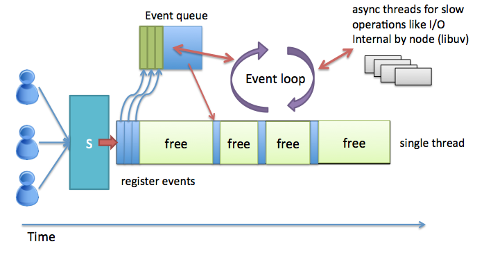
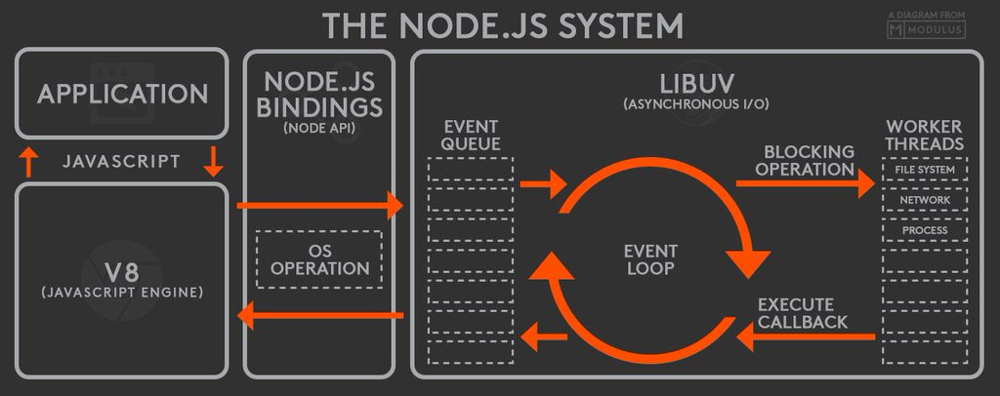

# The Node Platform

## Javascript Everywhere
For most developers javascript has always been a client script language for the web browser. In the beginning javascript was just a tool for code snippets that provided some kind of interaction on web pages, even though most interactive designers did preferred Flash for this task.

But [flash is announced to soon be dead](http://thenextweb.com/apps/2015/09/01/adobe-flash-just-took-another-step-towards-death-thanks-to-google/) and javascript has evolved a lot in the last couple of years. When AJAX came along javascript went from  being just a simple toy script language to be something developers could use to write real and significant web applications. The javascript engines of the browsers is getting faster and more optimized by the day and since node.js entered the community you don´t need to use PHP, Java or C# to write a backend for your web application. Now you can use javascript everywhere, front-end, as data format (JSON) and back-end. Where JAVA failed javascript has succeeded..."write once, run everywhere". Where XML failed, JSON has succeeded.

The node platform is also a fast evolving technology. That is important for the web community when the web platform and its application is getting more complex and demands the use of new technology. Take web based realtime application for example, a perfect match for the node platform and its non-blocking programming model.

## The History
First time we heard about node.js and javascript on the server was when Ryan Dahl presented it at the inaugural European JSConf on November 8, 2009. Be sure to watch [the original presentation!](https://www.youtube.com/watch?v=ztspvPYybIY). Ryan was interested in creating server push applications after looking at different solutions on making progress bars for uploading a file through a web browser. He was also interested in non-blocking programming techniques. So he started to write on his own project. After testing a couple of different languages for the project he realized that javascript was a perfect match with its non-blocking programing model. At this time the danish department of Google developed and released their javascript engine V8 which Ryan used in node. We can se V8 as virtual machine, written in C++, that node.js is built around. Ryan start woring at the [joyent company](https://en.wikipedia.org/wiki/Joyent). You can look at [a presentation](https://www.youtube.com/watch?v=SAc0vQCC6UQ) where Ryan describes the creation of node.js and why he choose the architecture he did.

Node.js operates on a single thread, using non-blocking calls, allowing it to support a lot of concurrent connections. The design of sharing a single thread between all the requests is intended for building highly concurrent applications. All non-blocking calls must provide a callback and if you are familiar of AJAX programming you should know how to do this.

## The Philosophy
Every platform has its own philosophy, principles that the community has accepted or an ideology of doing things that influence the evolution of the platform. In node.js this principles comes from the creator, Ryan Dahl and all the developers that have helped to build the platform. Some of the principles are inherited from javascript and some are taken from the UNIX philosophy. You don´t always have to follow this "rules" but its wise to know about these and important to understand when you design your node programs or looking at others.

#### Small core
The node.js core is build on the principle of having the smallest set of functionality and leave the rest of the functions to the "userland", the ecosystem of independent modules provided by the node platform developers. Instead of relying on a big and slow evolving core the features are often developed around the tight and stable core by open source developers. The core is hold to a bare minimum.

#### Small modules
The node ecosystem uses the concept of modules, often called packages. That is chunk of code built to handle a small part of functionality. This principle has its roots in the Unix philosophy that proclaim "Small is beautiful" and "Make each program do one thing well". This also empowers developers to use many smaller modules and reuse these into a bigger program. We can also call this "Don´t Repeat Yourself" (DRY) - a common and wide used rule in programming.

#### Small interface
The node community also encourage their modules to expose only a minimal set of functionality, often called a modules public API. This makes the module easy to understand and use and hides the complexity behind its functions. A module may only just expose a single function or constructor and let more complex features be exposed as properties of the exported function. This is to show the user of the module a single simple entry point. Another characteristic of many node.js modules is that they are build to use not to extend by locking down the internals. This could be inflexible but has the advantage of reducing the use cases and focus to do its only thing in a good way and provide simplicity.

#### Simplicity and pragmatism
Designing a simple, not a perfect, general and feature-full software is a good rule of thumb. It takes less time to implement, allows faster shipping, which is important in modern web development projects. It´s probably also easier to adept, maintain and understand. It's also common to see simple solutions in contrast to more classical object-oriented solutions with the arguments that a smaller more simplified solutions often is more simple to change and maintain when the software is going to change (which it certainly will do). "Keep it simple stupid" - KISS.

## How node.js work
Node has many characteristics; non-blocking, asynchronous, event-driven, single threaded. As a developer this is important to know because it is easy to do mistakes if we think in a blocking, multi-threaded way which is a more common model in web communities like PHP and Ruby on Rails.
But what does all these words mean and why does node choose them?

### Non-blocking I/O
I/O stands for Input/Output. In this case we can think of it as reading or writing data. That can be to memory, disk or network. This is often time consuming operations in a application. Of course it will be a slow operation if we use a synchronous model and always have to wait for the read/write operation to be done. This will block our code. Node gets away with this by doing most I/O tasks using nonblocking techniques. Rather than waiting line-by-line for an operation to finish, you create a callback function that will be invoked when the operation eventually succeeds or fails. As you are familiar to program in javascript you recognize this model with callbacks, event queue and event loop. Do you need to refresh your knowledge about this. Watch this speak from [Philip Roberts called "What the heck is the event loop anyway?"](https://www.youtube.com/watch?v=8aGhZQkoFbQ). Well it is really a good watch anyway. The speak is about the V8 engine in a browser but it similar to node.js, just change the Web APIs in the browser to I/O operations handled by the OS.

### Single Thread vs. multi-threaded
Classical web servers like Apache or IIS makes a new thread for every request that comes in. A thread can be seen as a own process in the operating system. This means that in theory we can have many threads running at the same time doing parallel works. There will be problem when different threads are trying to work against the same shared resources like the filesystem or a database. So threads have to look these resources up during there work and other threads get blocked and just have to wait to do their operations. Programming with threads can be very tricky hard and mostly you don´t want to think about that as a modern web developer. One other thing is that for every request multi-threaded servers spawn a new thread which costs memory and at some point the whole memory is used.

Node.js is using a single threaded model. This can sound a bit backward but a matter of fact this can optimize things. As you probably know javascript has a asynchronous nature with a event queue where you instead of blocking your code with I/O-operations you register callbacks to be called whenever the operation is ready leaving time for other codes to be executed. This free up the ability to handle many request which is one of the pros of using node.js as a web server. These images below try to illustrate the cases:

In the picture above we see a (very simplified) image of the blocking nature in a multithreaded server. We see three requests coming in to the server (the box named S). Each request spawn a thread and each thread tries to do different types of I/O operation meaning that they sometimes have to wait for each other and then block the threads code. Since every request gets an own thread we cant handle to many connections at the same time (depends on how powerful the server is).

In the other picture we see the node.js way. This should be familiar to you since you done some javascript coding before. Node.js has only one thread that register every I/O operation as events in the event queue. The event loop goes through this and decide if the events callback should invoke or if it should put the operation to be handle by node.js internal. If a I/O is registered the event loop delegete the work to an async thread pool which is handle by the libuv which is a C library handling this operations in the operating system. When the operation is done the event loop makes the registered callback invoke. Libuv is a part that node.js is using under the hood. As a web developer writing node applications you use the javascript API provided by node.js. See the below image for an other view of the node.js architecture:

This image was taken from: https://twitter.com/BusyRich/status/494959181871316992

If you want to get a real deep understanding of the node.js architecture please read this article [optional]

The big advantage of the node.js model is that we can handle a lot more requests than traditional multithreaded servers. Its also very suitable for asynchronous realtime application. The main draw back is that node.js isn´t suited for complex calculating operation like more synchronous complex algorithms. These will block the single thread and block the whole application. This is not good when we have a server application that listening for requests. In that way is node.js not a silver bullet and not a complete replacement for traditional web platforms. But as long as you are aware of this its a very likable platform to work with. If you need to do more complex stuff there are ways of creating new node processes to handle this. Try to to so much you can asynchronous to free up the main thread. Always return as fast as possible from the functions you code.

## Node.js vs io.js and the future
There been some different paths of evolving node.js. At one time a couple of developers forked the original code base of node.js () and started a own project they called [io.js](http://iojs.org). The developers get tiered of Joyents (the maintainer of node.js) development cycles and wanted to get things done more faster. They released io.js version 1.0 while node.js was on version 0.12-someting. These different path continued for a while till 2015-09-14 when the Node.js Foundation released an announcement telling that the two groups joined together in one same code base again starting with the node.js 4.0.0 version.

Today many big actors in the software area (like Microsoft, Yahoo, IBM, Intel) is supporting the development of the Node.js platform. They also have so called [Long-Term Support](https://github.com/nodejs/LTS/).

## References
* [Ryan Dahls original presentation of node.js](https://www.youtube.com/watch?v=ztspvPYybIY)
* [Ryan describes the creation of node.js](https://www.youtube.com/watch?v=SAc0vQCC6UQ)
* [Philip Roberts: What the heck is the event loop anyway? | JSConf EU 2014](https://www.youtube.com/watch?v=8aGhZQkoFbQ)
